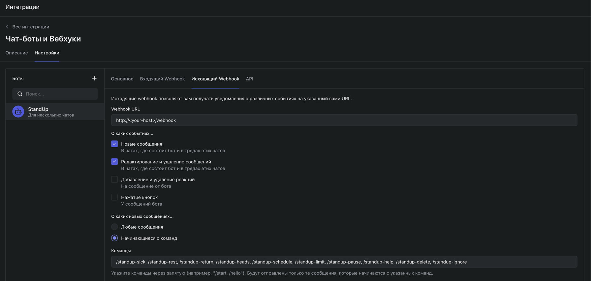
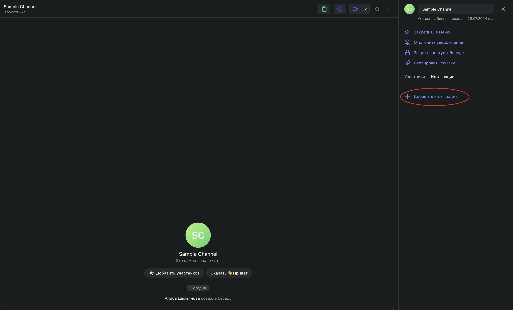

# Standup Bot for Pachca

Standup Bot представляет собой чат-бота, реализованного на FastAPI и использующего PostgreSQL в качестве базы данных. Бот предназначен для управления стендап-отчетами и работает в связке с внешним API. Проект развернут с использованием Docker.

## Возможности

    Сбор стендап-отчетов от пользователей в чате.
    Отправка напоминаний и сбор ответов.
    Отслеживание пользователей, которые болеют или находятся на отдыхе.
    Настройка специфических для чата параметров, таких как игнорируемые пользователи, расписание и временные ограничения для стендапов.
    Предоставление команд для управления поведением и настройками бота.

## Команды
```
/standup-sick - Отметить себя как болеющего.
/standup-rest - Отметить себя как отдыхающего.
/standup-return - Отметить себя как доступного для участия.
/standup-heads @nickname1 @nickname2 ... - Назначить руководителей стендапа в чате.
/standup-schedule день1 время1 день2 время2 ... - Установить расписание стендапов.
/standup-limit минуты - Установить временное ограничение для стендапов.
/standup-pause - Приостановить или возобновить стендапы в чате.
/standup-help - Получить информацию о доступных командах.
/standup-delete - Удалить все настройки стендапов для чата.
```
## Код
### main.py

Основной файл приложения, который содержит все обработчики запросов и логики бота.
### api.py

Модуль для взаимодействия с внешним API, включая получение информации о пользователях и чатах.
### handle_standup.py

Содержит функции для обработки стендап-отчетов и взаимодействия с пользователями.
### database.py

Модуль для работы с базой данных, содержит определения моделей и функции для взаимодействия с базой данных.
## Установка
1. Используя терминал, установите соединение с сервером.
2. Подготовьте сервер к работе:
 - git 
 ```
 sudo apt-get update
sudo apt-get install git
 ```
 - docker
 ```
sudo apt-get update
sudo apt-get install ca-certificates curl gnupg
sudo install -m 0755 -d /etc/apt/keyrings
curl -fsSL https://download.docker.com/linux/ubuntu/gpg | sudo gpg --dearmor -o /etc/apt/keyrings/docker.gpg
sudo chmod a+r /etc/apt/keyrings/docker.gpg

echo \
  "deb [arch=$(dpkg --print-architecture) signed-by=/etc/apt/keyrings/docker.gpg] https://download.docker.com/linux/ubuntu \
  $(. /etc/os-release && echo "$VERSION_CODENAME") stable" | \
  sudo tee /etc/apt/sources.list.d/docker.list > /dev/null
sudo apt-get update

sudo apt-get install docker-ce docker-ce-cli containerd.io docker-buildx-plugin docker-compose-plugin
 ```
 - PostgreSQL:
 ```
sudo apt install postgresql postgresql-contrib
 ```
3. Клонируйте репозиторий:
 ```
git clone https://github.com/yourusername/standup-bot.git
cd standup-bot
 ```
4. Создайте файл .env в корневой директории проекта и добавьте туда токен доступа и ID вашего бота (эту информацию можно найти в разделе "Автоматизации" -> "Чат-Боты и Вебхуки" -> "API"), а также информацию о базе данных:
```
access_token=your_access_token
bot_id=your_bot_id
DB_HOST=postgres
DB_PORT=5432
DB_USER=postgres
DB_PASS=postgres
DB_NAME=standup
```
5. Запуск контейнеров PostgreSQL и FastAPI:
- Запустите контейнеры:
    ```
    docker compose up -d --build       
    ```
- Создайте базу данных вручную, войдя в контейнер Postgres с использованием psql:
    ```
    docker exec -it postgres psql -U postgres
    ```
- Внутри psql выполните команду для создания базы данных:
    ```
    CREATE DATABASE standup;
    ```
- Выйдете из psql: 
    ```
    \q
    ```
6. Настройка чат-бота
В разделе "Автоматизации" -> "Чат-Боты и Вебхуки" -> "Исходящий Webhook" настройте следующие параметры:
 - В поле Webhook URL вставьте публичный IP вашего сервера в формате: 
   
   ```http://your_host/webhook```
 - Поставьте галочку напротив следующих пунктов:
   - Новые сообщения
   - Редактирование и удаление сообщений
   - Начинающиеся с команд
 - В поле команды вставьте следующую строку:
    - ```/standup-sick, /standup-rest, /standup-return, /standup-heads, /standup-schedule, /standup-limit, /standup-pause, /standup-help, /standup-delete, /standup-ignore```


7. Добавьте чат-бот в каналы, в которых хотите проводить стендапы 

## Взаимодействие с Docker-контейнерами
1. Просмотр всех контейнеров
Для просмотра всех контейнеров, включая остановленные:
```
docker ps -a
```
2. Просмотр логов контейнера

Чтобы посмотреть логи конкретного контейнера:
```
docker logs fastapi
docker logs postgres
```
3. Для остановки запущенных контейнеров:
```
docker stop $(docker ps -a -q)
```
4. Для удаления остановленных контейнеров:
```
docker rm $(docker ps -a -q)
```
5. Для запуска остановленных контейнеров:
```
docker start $(docker ps -a -q)
```
## Скачивание данных из удаленного контейнера PostgreSQL

1. Создание дампа изнутри контейнера:

Имея доступ к контейнеру через SSH, создайте дамп базы данных изнутри контейнера следующей командой:
```
docker cp postgres:/dumpfile.sql ./dumpfile.sql
```
2. Скачайте дамп находящийся на удалённом сервере на локальный компьютер, используя scp:
```
scp root@<your_ip>:dumpfile.sql /path/to/file
```
## Просмотр информации из базы данных PostgreSQL, запущенной в Docker-контейнере
1. Подключитесь к контейнеру:
Запустите команду для входа в контейнер:
```
docker exec -it postgres bash
```
2. Внутри контейнера подключитесь к PostgreSQL:
```
psql -U postgres -d standup
```
3. После входа в контейнер, используйте команду psql для подключения к базе данных:
```
\c standup
```
4. Просматривайте информацию:
В командной строке psql вы можете выполнять SQL-запросы, чтобы просматривать таблицы и данные. Например, чтобы увидеть все таблицы в базе данных, используйте:
```
\dt
```
Чтобы получить данные из определенной таблицы:
```
SELECT * FROM table_name;
```